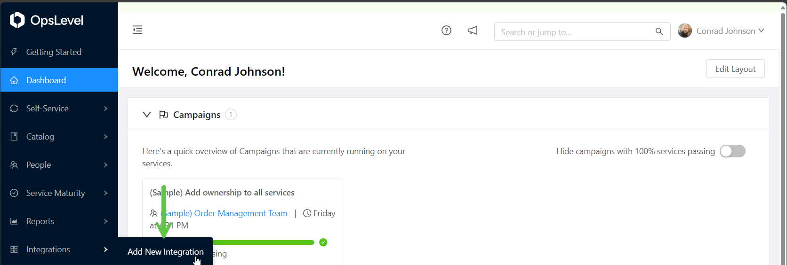
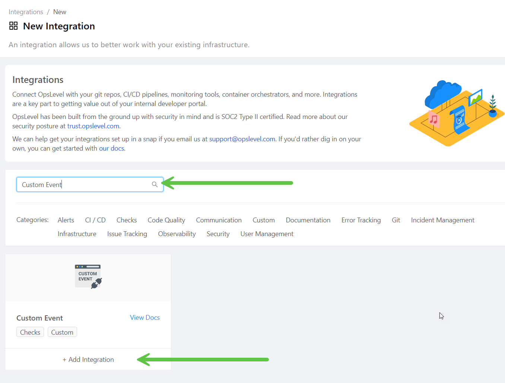
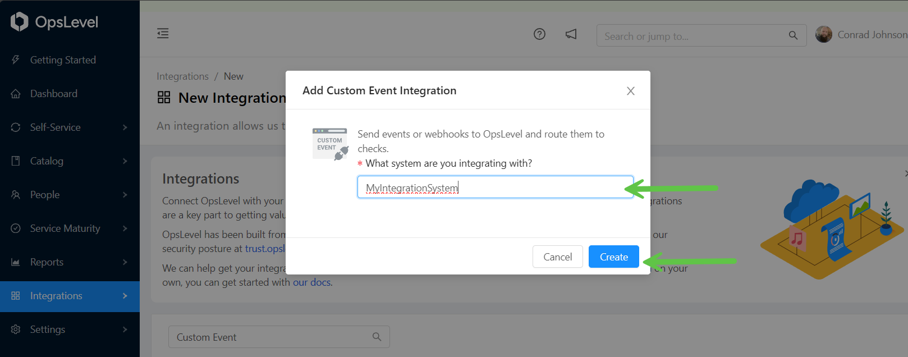
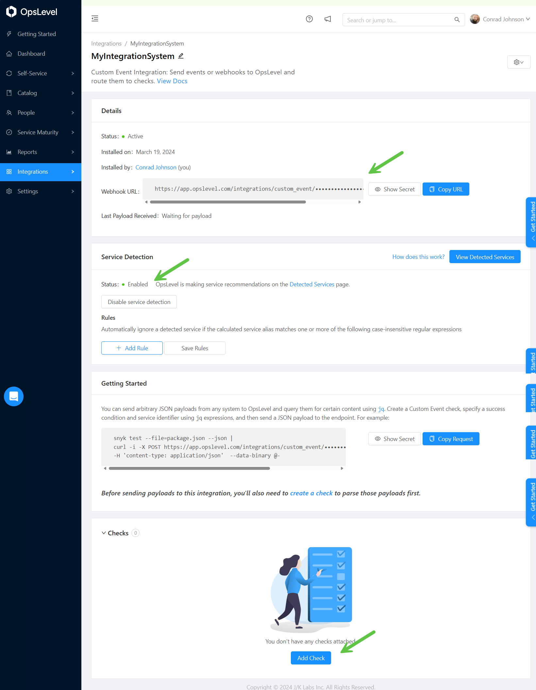
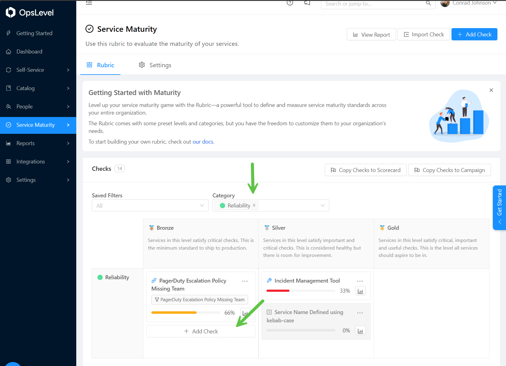
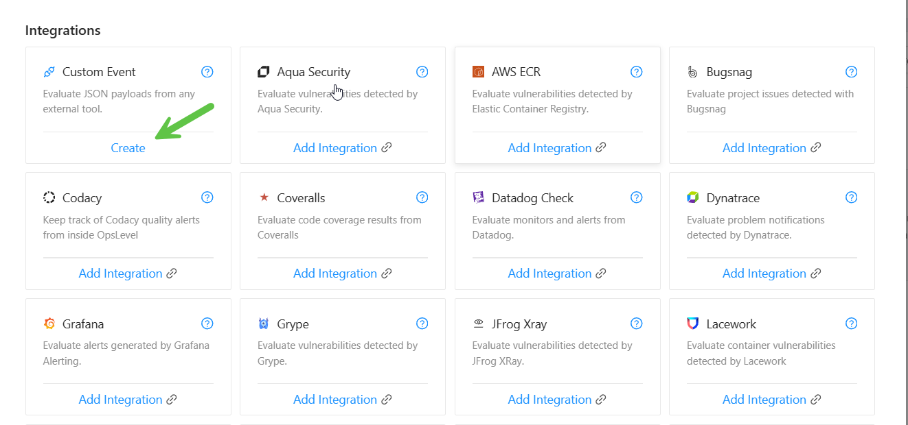
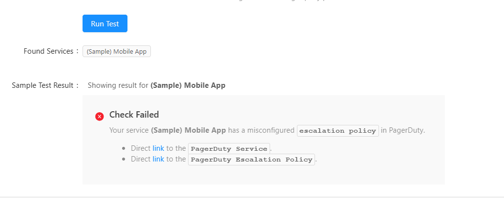
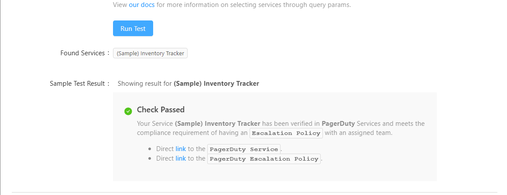

# OpsLevel

The following document will help learn the key steps to create a custom event in OpsLevel.

## Creating a Custom Event Integration

1. **Login to OpsLevel**:
   - Go to [OpsLevel](https://app.opslevel.com/) and login to your account.
2. **Create a Custom Event**:
   - Click on the `Integrations` tab on the left-hand side of the screen.
   - Click on the `Add New Integration` button.

   

3. Search `Custom Event` and click on the `Add Integration` button below.
   - Fill in the deesired name of the system you are integrating with.
   - Press `Create`

   

   

4. Observe your `Integration`
    - You will see the `Webhook URL` and `Secret Guid` this will be used to send json payloads to OpsLevel.
    - You will see `Service Detection` this is important to have `Enabled` for discover of the `Custom Event` to OpsLevel services.
    - You can add customizations to the `Rules` if you elect too
    - If want to read more see the [Getting Started](https://app.opslevel.com/rubrics)
5. Scroll to bottom and click `Add Check` which will navigate to the `Opslevel Maturity Rubric`



## Creating A Check For The Custom Event Integration

A `Check` is essential for identification of `OpsLevel Services` to the inbound json payload from the `Custom Event` integration.

1. **Create a Check**:
   - Navigate to the `Category` in the Maturity Rubric of where you wish to place your `Check`
   - Press `Add Check` in the respected `Service Tier` [OpsLevel Tiers](https://app.opslevel.com/account)

   

2. **Find the `Custom Event Check`**:
   - Press Create

   

3. **Start Writing a Check**

To start you need to analyze your `Custom Event Integration` json payload and determine what you want to check for. Here is an example of a `Custom Event` json payload:

Lets knock out the easy stuff.

1. Give your check a name
2. Give your check a filer (optional)
3.  Give your check an owner
4. Select your `Custom Integration` from previous section
5. Set your `Service Specifier`
 
 > This is how correlation to the `Service Catalog` is done. This is the most important part of the check. This is how OpsLevel will know what service to associate the `Custom Event` with.

Lets look at some json and drive a statement using `jq` to discover our `Services` we wish to apply this check too.

***Negative Payload Check Example***

```json
{
  "messages": [
    {
      "id": "PTPQEDM",
      "name": "(Sample) Mobile App",
      "self": "https://api.pagerduty.com/services/PTPQEDM",
      "type": "service",
      "teams": [
        {
          "id": "P66WHU6",
          "self": "https://api.pagerduty.com/teams/P66WHU6",
          "type": "team_reference",
          "summary": "(Sample) Order Management Team",
          "html_url": "https://dev-nov4io.pagerduty.com/teams/P66WHU6"
        }
      ],
      "addons": [],
      "status": "active",
      "summary": "(Sample) Mobile App",
      "html_url": "https://dev-nov4io.pagerduty.com/service-directory/PTPQEDM",
      "created_at": "2024-03-15T21:38:26-04:00",
      "updated_at": "2024-03-15T21:38:26-04:00",
      "description": "Our mobile app. Find us in any App Store!",
      "integrations": [],
      "response_play": null,
      "support_hours": null,
      "alert_creation": "create_alerts_and_incidents",
      "alert_grouping": null,
      "escalation_policy": {
        "id": "PVUHL5V",
        "self": "https://api.pagerduty.com/escalation_policies/PVUHL5V",
        "type": "escalation_policy_reference",
        "summary": "Default",
        "html_url": "https://dev-nov4io.pagerduty.com/escalation_policies/PVUHL5V"
        "teams": []
      },
      "scheduled_actions": [],
      "auto_resolve_timeout": null,
      "incident_urgency_rule": {
        "type": "constant",
        "urgency": "high"
      },
      "alert_grouping_timeout": null,
      "acknowledgement_timeout": null,
      "last_incident_timestamp": null,
      "alert_grouping_parameters": {
        "type": null,
        "config": null
      }
    }
  ]
}
```
For this we would set the `Service Identifer` by name.

```bash
.messages[] | .name
```


6. Set a `Success Condition`

```bash
.messages[] |  select(.name == $ctx.alias) | .escalation_policy.teams | length > 0
```
We are looking at the messages array and selecting the .name and matching it to the $ctx.alias.  The $ctx.alias is how Opslevel passes a name to our check. Next we are looking for the ***escalation_policy.teams*** and checking if the length is greater than 0. This is a simple check to see if the team is associated with the service.


7. **Success and Fail Checks**

This uses [Liquid](https://docs.opslevel.com/docs/custom-event-checks#liquid-templating). Put simply is a syntax that allows manipulation of data to be displayed in markdown with the ability to do logical operations.

```txt

  ### Check Passed
  Your Service **{{ data.messages[ctx.index].name }}** has been verified in **PagerDuty** Services and meets the compliance requirement of having an `Escalation Policy` with an assigned team.

  - Direct [link]({{ data.messages[ctx.index].html_url }}) to the `PagerDuty Service`.
  - Direct [link]({{ data.messages[ctx.index].escalation_policy.html_url }}) to the `PagerDuty Escalation Policy`.


  ### Check Failed
  Your service **{{ data.messages[ctx.index].name }}** has a misconfigured  `escalation policy` in PagerDuty.

  - Direct [link]({{ data.messages[ctx.index].html_url }}) to the `PagerDuty Service`.
  - Direct [link]({{ data.messages[ctx.index].escalation_policy.html_url }}) to the `PagerDuty Escalation Policy`.


```

**Opslevel Variables**
|Variable|Description|
|--------|-----------|
$ctx|The context object for each found service alias.
$ctx.alias|The service alias found in your payload.
$ctx.index|The index in the list where the service was found.
$ctx.count|The number of services found.
$params|The URL query parameters provided in the POST request sent to the Custom Event Integration endpoint.


**Liquid Variables**
|Variable|Description|
|--------|-----------|
|check|The check object contains information about the check result|
|check.passed|A boolean value of whether the check passed.|
|check.failed|A boolean value of whether the check failed.|
|check.status|A string of the current check status, passed or failed.|
|data|The data object gives you access to the payload sent to the OpsLevel Custom Event Integration endpoint.|
|ctx|The context object for each found service alias that contains alias, index, and count — just as in the Success Condition|
|params|The URL query parameters parameters provided in the POST request sent to the Custom Event Integration endpoint.|

8. **Load the Sample Payload**

This allows you to check your condition. The sample above should fail.
If you need a successful check use this json.

**Negative Payload Check Example***
```json
{
  "messages": [
    {
      "id": "PTPQEDM",
      "name": "(Sample) Mobile App",
      "self": "https://api.pagerduty.com/services/PTPQEDM",
      "type": "service",
      "teams": [
        {
          "id": "P66WHU6",
          "self": "https://api.pagerduty.com/teams/P66WHU6",
          "type": "team_reference",
          "summary": "(Sample) Order Management Team",
          "html_url": "https://dev-nov4io.pagerduty.com/teams/P66WHU6"
        }
      ],
      "addons": [],
      "status": "active",
      "summary": "(Sample) Mobile App",
      "html_url": "https://dev-nov4io.pagerduty.com/service-directory/PTPQEDM",
      "created_at": "2024-03-15T21:38:26-04:00",
      "updated_at": "2024-03-15T21:38:26-04:00",
      "description": "Our mobile app. Find us in any App Store!",
      "integrations": [],
      "response_play": null,
      "support_hours": null,
      "alert_creation": "create_alerts_and_incidents",
      "alert_grouping": null,
      "escalation_policy": {
        "id": "PVUHL5V",
        "self": "https://api.pagerduty.com/escalation_policies/PVUHL5V",
        "type": "escalation_policy_reference",
        "summary": "Default",
        "html_url": "https://dev-nov4io.pagerduty.com/escalation_policies/PVUHL5V"
        "teams": []
      },
      "scheduled_actions": [],
      "auto_resolve_timeout": null,
      "incident_urgency_rule": {
        "type": "constant",
        "urgency": "high"
      },
      "alert_grouping_timeout": null,
      "acknowledgement_timeout": null,
      "last_incident_timestamp": null,
      "alert_grouping_parameters": {
        "type": null,
        "config": null
      }
    }
  ]
}
```


***Sucessful Payload Check Example***
```json
{
  "messages": [
    {
      "id": "PWLBFTP",
      "name": "(Sample) Inventory Tracker",
      "description": "Our core tracking tool for managing stock and scheduling procurement.",
      "created_at": "2024-03-15T21:38:25-04:00",
      "updated_at": "2024-03-15T21:38:25-04:00",
      "status": "active",
      "teams": [
        {
          "id": "P66WHU6",
          "type": "team_reference",
          "summary": "(Sample) Order Management Team",
          "self": "https://api.pagerduty.com/teams/P66WHU6",
          "html_url": "https://dev-nov4io.pagerduty.com/teams/P66WHU6"
        }
      ],
      "alert_creation": "create_alerts_and_incidents",
      "addons": [],
      "scheduled_actions": [],
      "support_hours": null,
      "last_incident_timestamp": null,
      "escalation_policy": {
        "id": "PVUHL5V",
        "type": "escalation_policy_reference",
        "summary": "Default",
        "self": "https://api.pagerduty.com/escalation_policies/PVUHL5V",
        "html_url": "https://dev-nov4io.pagerduty.com/escalation_policies/PVUHL5V",
        "teams": [
          {
            "id": "P66WHU6",
            "type": "team_reference",
            "summary": "(Sample) Order Management Team",
            "self": "https://api.pagerduty.com/teams/P66WHU6",
            "html_url": "https://dev-nov4io.pagerduty.com/teams/P66WHU6"
          }
        ]
      },
      "incident_urgency_rule": {
        "type": "constant",
        "urgency": "high"
      },
      "acknowledgement_timeout": null,
      "auto_resolve_timeout": null,
      "alert_grouping": null,
      "alert_grouping_timeout": null,
      "alert_grouping_parameters": {
        "type": null,
        "config": null
      },
      "integrations": [],
      "response_play": null,
      "type": "service",
      "summary": "(Sample) Inventory Tracker",
      "self": "https://api.pagerduty.com/services/PWLBFTP",
      "html_url": "https://dev-nov4io.pagerduty.com/service-directory/PWLBFTP"
    }
  ]
}
```


9. **Run Tests**

Load each test indivuidually and test your check. This is important to ensure your check is working as expected.

10. **Add any additional information about the check you want to relay**

```txt
**Why Escalation Policies and Team Assignments are Essential**

Escalation policies with assigned teams are crucial for rapid and effective incident management. Here's why:

- **Clarity and Accountability:** Assigns clear responsibility, enhancing accountability for incident resolution.
- **Expertise Utilization:** Ensures the right team with the right skills is engaged at the right time.
- **Improved Coordination:** Facilitates smoother coordination by defining roles and escalation triggers clearly.
- **Enhanced Communication:** Promotes better intra and inter-team communication, reducing misunderstandings and delays.
- **Monitoring and Improvement:** Allows for performance monitoring and identifying areas for refinement, optimizing the incident response process over time.

This structured approach not only ensures efficient issue resolution but also supports service reliability, benefiting both the organization and its customers.
```


11. **Enable your check**
12. **Send Payload Payload to the `Custom Integration`**
13. **Under `Catalog` Left Menu, Select `Detected Services and `Merge` discoveries from your `Custom Event` integration.**